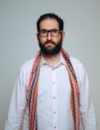

# Totem Circle Keeper Training - Week 1 Introduction

## **Introduction: History of Circle**

O process is a community dialogue practice rooted in the tradition of First Nation People in Canada.&#x20;

Kay Pranis, a teacher and mentor for many of our Totem leaders, and a national expert in restorative justice who specializes in peacemaking Circles wrote:&#x20;

_I first learned about Circles in 1995 from Barry Stuart, a white man, who was then a judge in Yukon, Canada. When I recruited a jurisdiction in Minnesota to pilot the idea of Sentencing Circles, I asked Barry to come to train us. He told me that it would be important to also include community members doing the training. So, I was trained by Barry and three First Nations people from Yukon, Canada, in 1996. Two of those community members continued to come to Minnesota repeatedly doing Circle training for us: Harold Gatensby and Mark Wedge. I attended multiple trainings with them and over time began to support them in the training process. They are members of the Klingkut - Tagish Nation in Yukon, though many of the teachings they shared came from another indigenous man who was from a Plains Indian nation. Consequently, the teachings are not just from their own lineage._&#x20;

_Another important element of my understanding of the Circle process comes from a Native American woman who lives in the Twin Cities in Minnesota (where I live.) She became a guide and mentor to me and it was from her that I got a deeper understanding of the worldview embodied by the Circle process, particularly the sense of interconnectedness and equality of all things. Her name is Tahnahga. Her lineage is Mohawk, Anishinabe, and Taino._&#x20;

_I have been fortunate to have many wonderful teachers (consciously and unconsciously). Those above are the ones that have a well-defined lineage. It was from the First Nation people that I learned the concept of honoring the lineage as a way of respecting the gift of the teaching._&#x20;

O dialoguing uses structure to create possibilities for freedom: freedom to speak our truth, drop our masks and protections, be present in our entirety, reveal our deepest shadows, acknowledge mistakes and fears, act in accord with and state our core values. The key structural elements of O provide the necessary ingredients to elicit an aspect of creativity within the human spirit that is rooted in both discipline and vulnerability.&#x20;

Our current cultural practices often encourage separation, demonization of those with whom we disagree, non-functional competition, dependence on one dimensional hierarchy, and reliance on the word of experts. O returns us to relying on our collective wisdom.&#x20;

O is a catalyst that creates spaces of respect and reflection. In O, people find their way through anger, pain, and fear into shared experience with others. This can solve complex problems. O is simple but it is not easy.&#x20;

In O teachings and expertise are not the primary source for insight. Participants tell personal narratives and use self-reflection to achieve discernment and transformation. Shifting from giving advice and providing answers to sharing personal stories and raising questions (to which the participant does not already have an answer) is profound.&#x20;

O Process assumes that no participant sees the whole picture. Only by sharing all of our perspectives can we approach truth. Sharing individual perspectives creates a collective wisdom greater than the sum of its parts.&#x20;

We believe every participant has a gift/s which will unlock solutions to the struggles, obstacles, needs, and desires of the other participants. Any point of view is only a single view from one point on the rim of the O. &#x20;

### **Meet our Trainers**

<figure><figcaption>
<strong>Ted Wallach</strong> <strong></strong>Chief Circle Officer &#x26; Your Co-Keeper
</figcaption></figure>

Ted has a clinical practice, coaching individuals using Taoism and Quantum Mechanics to manifest the best versions of themselves. He founded Quantum Warrior, a 12-week online men’s Circle from his work at the Peace Innovation Lab at Stanford where he is a visiting scholar. He recently joined the UN Global Help Desk and had the honor of supporting Vint Cerf with the writing of his speech to the UN General Council.&#x20;

Ted cut his teeth under Martin Scorsese. Directing and producing for over a decade in Bollywood, Hollywood, the Middle East, and Europe. The original Creative Director of WeWork, Ted created campaigns for ending oil subsidies to building wells in Africa with Charity Water.&#x20;

After working with several marketing agencies in NYC, he created The AMEX Trifecta of Upward Mobility with Small Business Saturday team. He became CSO and then CEO of TimeRepublik a global digital time bank and returned to THNK: School for Creative Leaders where he did his post-graduate work as an expert in residence supporting fledgling ventures with digital alternative currency strategies.&#x20;

Then he found circle and his entire life changed...

<figure><figcaption>
<strong>Stephanie Ressler</strong> <strong></strong>Head of Curriculum &#x26; Your C0-Keeper <strong></strong>
</figcaption></figure>

Stephanie is a trained Clinical Mental Health Counselor, Life Coach, Hypnosis Practitioner, and Breathwork Facilitator who is passionate about helping people learn how to reconnect with their body’s internal wisdom and reintroduce them to the truth of who they are.

Stephanie first encountered Circle and the power of Restorative Justice in 2008 while taking classes at the Center For Justice and Peacekeeping with Kay Pranis and she knew almost instantly that holding and participating in this unique space with others was part of her own purpose in life.

Since then, Stephanie has trained to become a Circle Keeper with Elizabeth Clemants, participated in continued education opportunities through the International Institute of Restorative Practices (IIRP), and has used Circle to promote healing and self-growth in school and community settings around the globe.

### Totem’s Mission

Our human need to connect is not being satisfied online. It can be and it must be.&#x20;

The more we hear about connection, the less actual connection seems to occur. Still, we need it. And every day we spend more time online searching for it.&#x20;

We need each other. We need a digital campfire to be together online rather than a gossip factory. We need a place where it is safe to share to be known and listen to know others. “Social” media does not provide this space but it does exacerbate the need.&#x20;

There is an ancient technology that can solve this problem. Circle.&#x20;

Circle, combined with the internet, may be able to create the digital campfire that we desperately need in order to be successful in building a tech tool that does not cause the same problem it purports to solve. We will need to proceed with caution. We know that we must continue to test our assumptions, not against platitudes (for example, “make the world a better place,” “ do no evil,” “ connecting world happiness in a bottle” etc.) but a constant vigilant and crowdsourced inquiry into the actual impact that our tool is having, and an honest reckoning with what this inquiry provides, regardless of our ego’s attachment to the tools of its manifestation. Said simply, if it hurts people more than it helps people then we will “pull the plug.”&#x20;

We are not sharing this technology because we _want_ _to_. We are sharing it because we _need_ _to_.

### Our Mission for Circle Keepers

In order to live out this mission, we hope to share the power, philosophy, and benefits of Circle with others who feel called to hold this space for the collective. This is where you come in.

Similar to the role of a Fire Keeper in many indigenous rituals and ceremonies where the primary responsibility is to ensure that the fire stays lit, a Totem Circle Keeper (TCK) maintains and stokes the energetic “fire” of a group of people who are stepping into this space together. The keeper ensures that a circle has a beginning and an end, and tends to the space in between so that the others can immerse themselves in a deeper, more integrated ritual of self-exploration and connection.

Those who take the time to learn and understand the underlying nuances, philosophy, and energetic principles of Circle are able to offer this gift for the rest of their lives. The skills and deeper understanding of the human exchange that are unearthed during the process are applicable whether you're in an official circle or not. The embodiment practice of deep listening and holding space, and the felt sense of safety within oneself and as part of an interconnected community are powerful components of this healing modality. They are a gift to those you are in contact with in all areas of your life. Likewise, you can choose to be in Circle whenever you want and the opportunities for this type of authentic exchange are endless.

Our mission is to uphold the quality of the ancestral work that we're doing, hold sacred the powerful wisdom from indigenous cultures, remember the lineage, and continue to be in awe of the subtle and profound powers of O. We aim to share our love of O to inspire you with an urgency to spread this healing tool to a world in desperate need of actual connection. O’s medicine is seeing others and being seen. We intend to model this so that you might pass on this magic.

## Circle Overview

### The Five Constituent Elements of O

_\*Watch Ted teach on this topic_[ _here_ ](https://www.veed.io/view/6a99b8c5-f673-4c48-8d3d-39d041ccf6a0?panel=share)(please note that the video starts 33 seconds in)

The following are intentional structural elements of Circle Process:

#### Ceremony

Os use ceremony or an intentional centering activity in the opening and closing to mark the O as a sacred space in which participants are present with themselves and one another in a way that is different from an ordinary meeting.&#x20;

_Opening ceremonies_: Helps participants to center themselves (move from head to heart or actually brings head and heart into coherence), be reminded of core values, clear negative energies from unrelated stress, and honor the presence of all present.&#x20;

_Closing ceremony_: Acknowledges the efforts of the O, affirms the interconnectedness of those present, and prepares participants to leave this non-ordinary reality and return to ordinary space.

#### O Keeper

The keepers are also a participant in the process and share their thoughts, ideas, and stories. Minimizing a bias toward the Keeper as an expert or authority is a goal of O Process. This is achieved by the keeper modeling vulnerability not by holding a clinical distance. A key role of the facilitator is to uphold the integrity, safety, and forward movement of the O process.

#### Guidelines

This is an intentional process for the community to converse about what they expect from each other and to which expectations and behavior they are willing to commit. The community builds these standards of behavior from shared values and considering how our choices impact each other. The guidelines arise out of asking people what they need for themselves and from others, and then naturally, those guidelines apply to everyone in the O.

#### Consensus

Decision-making through consensus is generally understood to mean all participants are willing to live with the decision and support its implementation. Consensus decision-making requires listening and reflection before making decisions. It is grounded in a commitment to honoring the needs and interests of all participants. Consensus decisions can produce effective, sustainable agreements because power is shared. Achieving consensus requires the group to pay attention to the interests of those who normally may not have power in the group.

#### The absolute basics:

There are three basic rules of O:

1. The talking piece goes in one direction.
2. When you have the talking piece it is your turn to share, when you do not have the talking piece it is your turn to listen (You are encouraged to speak from your own lived experience).
3. You are always free to pass.

#### O structure

_Opening Ceremony_ \
__\
_Check-in_ \
__\
_Question#1_ \
_Question#2_ \
_Question#3_ \
__\
_Check-out_ \
__\
_Closing Ceremony_

#### &#x20;       
